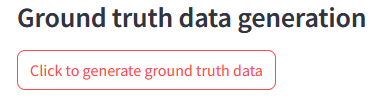

### Description

This is the final project for the DataTalks Club LLM Zoomcamp 2024.

In this project we will build an eCommerce site assistant. 

eCommerce sites - also known as eShops - are used by milions of people worldwide. Some of these sites are sometimes difficult to handle so people who use them start having questions. The reason for building this assistant is that a user having a question can immediately ask the assistant to get around his problem, instead of sending an email, submitting a question form or trying to find someone on the phone.

### Dataset  

We will use the Ecommerce-FAQ-Chatbot dataset from Kaggle. The dataset can be found in the URL below:  

https://www.kaggle.com/datasets/saadmakhdoom/ecommerce-faq-chatbot-dataset

as a JSON file, but we have converted it to a CSV file.

The file can also be found in the data folder as data.csv

### Tecnologies used

#### Elastic search
  
Elastic Search is used so that we can perform a vector search. The retrieved results are then used to build a prompt and a context which will be sent to an LLM. In our 
case Open AI gpt-4o-mini. When the application starts for the first time all the questions and answers from the data.csv file are stored in the Elastic Search database 
in text and vector format.

#### Postgres
  
A Postgres database is used for storing the user questions and the assistant answer along with other information. User feedback is also stored in this database. When 
the application starts for the first time all the necessary database tables are created.

#### Streamlit
  
Streamlit is used to create the user interface (UI). The user types a question, hits the Enter button and after a while an answer is produced by the assistant. The user
question and the generated answered are stored in the Postgres database. There are also Thumbs Up and Thumbs Down buttons so that the user can provide a feedback. 
Thumbs Up for a relevant answer and Thumbs Down for a non relevant answer. Feedback is also stored in the Postgres database.

#### Grafana
  
Grafana is used for monitoring the system. On a dashboard you can monitor things like positive and negative feedback, LLM cost etc.

#### Docker
  
Every application component mentioned above is actually a docker container. When we start the application all the containers start one by one in a specific order until the user interface is presented to the user and we can start typing questions.

### Application flow

The application follows a typical RAG flow.

* The user types in a question.
* The most relevant answers are retrieved from an Elastic Search database
* The most relevant answers are then used to create a context and a prompt
* The prompt is sent to an LLM
* The LLM generates an answer

#### RAG flow diagram
  

### Application structure

The following folders/files are included in the application:

* **app** folder. This folder contains all the file needed for the application to run.
* **data** folder. The application data file, the ground truth data file and the offline RAG evaluation files are stored here.
* **grafana** folder. Grafana dashboards and data sources are stored here in JSON format.
* **pages** folder. Python files used by Streamlit.
* **Welcome.py**. This is the application entry point. It is the file that is loaded when the Streamlit container starts.
* **docker-compose.yaml, Dockerfile.grafana** and **Dockerfile.streamlit** are used by docker to create all the application containers.
* **es.py**. This file is used for elastic search operations, eg initializing the Elastic Search database and indexes.
* **eval.py**. All Retrieval and RAG evaluation functions are stored in this file. Ground Truth data file and also files for Offline RAG evaluation are generated by functions in this module.
* **postgres.py**. This file is used to interact with the Postgres database, eg store the user feedback.
* **rag.py**. Interaction with the LLM is done by using functions from this file.
* **utils.py**. Various functions, eg function for the the conversion of the JSON file to CSV format.
* **requirements.txt**. All python libraries used by the application are stored here.
* **.env.template**. The file where all environment variables are stored.
* **README.md**. This file.
  
### Run the application

#### Install Docker and Docker Compose 
To install Docker and Docker Compose you can use the following links:

https://docs.docker.com/engine/install/  
https://docs.docker.com/compose/install/

#### Clone the github repository
Open a terminal, navigate to a folder where you want the repository files to be stored and then type:  

```console
git clone https://github.com/sgkertsos/ecommerce-site-assistant.git
```
#### Update your Open AI API key
Open a terminal and type:
```console
cd ecommerce-site-assistant
cd app
cp .env.template .env
rm .env.template
```
Open the .env file by typing: 
```console
nano .env
```
Go to the Open AI section and fill in you Open AI API key between the quotes for the OPENAI_API_KEY environment variable. Save the file.

To create an Open AI API key you can use the instructions in the following link:

https://platform.openai.com/docs/quickstart

#### Start the application
Assuming that you are already in the app folder, start the application by typing the following command:

```console
docker compose up
```
Wait for the application to load. 

After the application loading is done we have the four docker containers running simultaneously:

* ElasticSearch on port 9200  
* Postgres on port 5432  
* Streamlit on port 8501  
* Grafana on port 3000  

### Access eCommerce assistant user interface
Open your preferred browser and navigate to the following address:

http://localhost:8501

The application loads and you are presented with a Welcome page.


When the application runs for the first time the following happen:

* An Elastic Search index is created and all data from the **data/data.csv** file are ingested to the index. The index name is set in the **ELASTIC_INDEX_NAME** environment variable.
* A Postgres database is created along with the **dialogs** and **feedback** tables. Postgres database name is also set in the **POSTGRES_DB** environment variable.

The next time the application runs, it checks if the index and the database exist and skips the initialization step.
  
After the application loads you can click on the Assistant option on the Sidebar. The assistant UI loads and you can start asking questions and leaving feedback.

Questions you can ask could be:

* How can I pay?
* Can I return a product?

and many other.


### Access Grafana
Open you preferred browser and navigate to the following address:

http://localhost:3000

Grafana loads. Use admin for user name and password. If Grafana prompts you to change the password you can type one of your own.
Click on the hamburger menu on the top left corner and then click on Dashboards. Select eCommerce assistant dashboard.

Now you can watch the data on the dashboard update when you perform questions to the eCommerce assistant. A time interval of 5s has been set for the dashboard refresh. You can see the Grafana dashboard below:

  

The panels you can see on the Grafana dashboard are:

* Dialogs: In this panel you can see the last 10 dialogs between the user and the assistant.
* Feedback: In this panel you can see user Feedback. You can see the total number of thumbs up and thumbs down.
* Total tokens: In this panel you can see the total normal and evaluation tokens used.
* Total cost: In this panel you can see the total cost for all the dialogs and the evaluations made.
* Relevance spread: This panel shows us how many Relevant, Non relevant and Partly relevant answers we have.

### Retrieval evaluation

To evaluate Retrieval a ground truth dataset file was generated:

* ground-truth-data.csv

5 questions are generated for each record in the **data.csv** file.

You can generate the ground truth file again if you want by clicking on the **Click to generate ground truth data**.



**Please note that the file generation may take a long time. Charges will also apply for the conversion.**


This ground truth data file was used to calculate some metrics like hit rate and mrr.
The calculations were made for text search and also for vector search retrieval. You can also perform and see the calculations by first selecting Retrieval evaluation on the sidebar. To calculate and see the metrics for text search click on the first button **(Click to evaluate text search retrieval)**. After a while you see the following:

  

To calculate the same metrics for vector search retrieval click on the second button **(Click to evaluate vector search retrieval)**. After a while you see the following:

  

As you can see the metrics for the vector search retrieval are better so that is why we use vector search in our application.

### RAG evaluation

In the applcation we have used both offline and online RAG evaluation.

### Offline

To perform offline RAG evaluation two files were generated:

* gpt-35-turbo-results.csv
* gpt-4o-mini-results.csv

For each question in the Ground Truth dataset an answer is generated.

You can generate the two files again if you want by clicking on the **Click to generate files for offline evaluation**.


**Please note that the file generation may take a long time. Charges will also apply for the conversion.**

Below you can also see the amount of money spent for the file generation:

    

As we can see almost the same amount of money was spent for both models.

The two files were then used to calculate Cosine Similarity for both **gpt-3.5-turbo** and **gpt-4o-mini** models. You can see the calculations by clicking the **Click to calculate cosine similarity** button.


From the **gpt-3.5-turbo** graph we can see that by using **gpt-3.5-turbo** model we get more records with high cosine similarity. 

### Online

For our application we have used online RAG evaluation by storing User Feedback and also Answer Relevance. Both can be seen by selecting RAG evaluation on the sidebar and then clicking the **Click to go to Grafana and check the User Feedback and the Relevance Spread**. Follow the  instructions in the Grafana section mentioned earlier to access the Grafana Dashboard.

#### User Feedback panel

You can see the User Feedback panel below:


#### Relevance Spread panel

You can see the Relevance Spread panel below:

  

### Notes

#### Access postgres database
You can access the postgres database by using the pgcli client. 

To install it open a terminal and type:

```console
pip install pgcli -U
```

Then to access the database type:

```console
pgcli -h localhost -p 5432 -U p_user -d ecommerce_assistant
```

For password type:

p_pwd

Now you can interact with the postgres (dialogs and feedback) database

#### Access streamlit container terminal
First you have to find the streamlit container id.

Type:

```console
docker ps
```
and note the streamlit container id, eg 68967bc26fc0

Copy the container id and then type:

```console
docker exec -it 68967bc26fc0 bash
```
You are now in the **/app** folder and you are ready to interact with the application files, eg change an environment variable.

